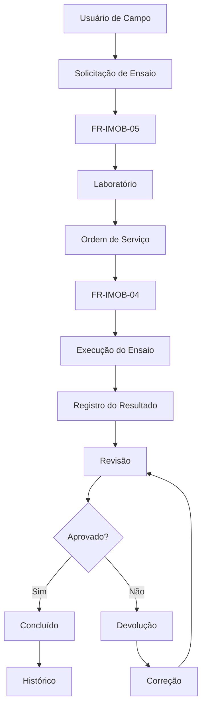

# CNRO Lab Control

**Sistema Operacional para Gestão de Ensaios e Controle Tecnológico de Obras Rodoviárias**

O **CNRO Lab Control** é uma aplicação web desenvolvida para apoiar o gerenciamento do fluxo de **solicitação, execução, registro, revisão e acompanhamento de ensaios laboratoriais e de campo** relacionados ao controle tecnológico de obras rodoviárias.

O sistema foi concebido para centralizar informações, padronizar o fluxo operacional e proporcionar maior rastreabilidade aos pedidos de ensaios, ordens de serviço e resultados.

---

## Visão geral

O sistema organiza o processo entre os diferentes envolvidos no controle tecnológico, permitindo que as informações sejam registradas e acompanhadas digitalmente.

O fluxo principal contempla:

```text
Campo
  ↓
Solicitação de Ensaio
  ↓
Laboratório
  ↓
Ordem de Serviço
  ↓
Execução / Registro do Ensaio
  ↓
Revisão
  ↓
Conclusão
  ↓
Histórico
```

Além do preenchimento digital, o sistema possui estrutura para **upload de fotos ou PDFs de fichas e extração automática de informações por IA**, permitindo posterior conferência dos dados antes da confirmação.

---

## Principais funcionalidades

### Autenticação

- Login utilizando e-mail e senha.
- Autenticação integrada ao Supabase.
- Persistência da sessão do usuário.
- Logout.
- Carregamento automático do perfil após autenticação.
- Indicação visual do estado de conexão.

O sistema verifica uma sessão existente ao iniciar e acompanha alterações no estado de autenticação.

---

### Gestão por perfis

A interface é adaptada de acordo com o perfil do usuário.

Perfis previstos no sistema:

| Perfil | Finalidade |
|---|---|
| `CAMPO` | Solicitação e acompanhamento de pedidos |
| `LAB` | Gestão e processamento dos ensaios laboratoriais |
| `ASSIST` | Registro e processamento dos resultados |
| `GESTOR` | Acompanhamento e gestão operacional |
| `DEV` | Administração e desenvolvimento do sistema |

A navegação e as funcionalidades disponíveis são carregadas dinamicamente conforme o perfil do usuário autenticado.

---

## Solicitação de Ensaios

O sistema utiliza a ficha:

**FR-IMOB-05 — Solicitação de Ensaios/Estudos**

A ficha permite registrar informações relacionadas à solicitação e às localizações das amostras.

As localizações podem conter:

- KM;
- pista;
- faixa/trilho;
- informações da amostra;
- observações.

Os dados podem ser preenchidos automaticamente a partir do pedido e posteriormente ajustados pelo usuário.

Também são contemplados diferentes tipos de solicitação, como:

- Contraprova;
- Investigação;
- Estudo;
- Outros.

---

## Ordem de Serviço

O sistema possui geração e gerenciamento da:

**FR-IMOB-04 — Ordem de Serviço**

A Ordem de Serviço é associada ao pedido de ensaio e pode ser preenchida a partir das informações previamente cadastradas.

Entre os dados utilizados estão:

- número da O.S.;
- obra;
- lote;
- solicitante;
- data da solicitação;
- ensaios selecionados;
- observações.

A ficha pode ser salva e preparada para impressão em formato adequado para PDF.

---

## Gestão do fluxo de ensaios

Cada pedido pode passar por diferentes estados operacionais:

- `Aguardando Lab`
- `Em Análise`
- `Em Andamento`
- `Aguardando Revisão`
- `Concluído`
- `Devolvido — Campo`
- `Devolvido — Assistente`
- `Cancelado`

Esses estados permitem acompanhar o andamento de cada solicitação e identificar pendências no processo.

---

## Registro de resultados

O sistema possui estrutura para registrar diferentes tipos de ensaios e seus respectivos resultados.

O preenchimento pode ocorrer de forma:

- **Digital**, diretamente através do formulário;
- **Por upload**, utilizando arquivo ou imagem da ficha.

Os resultados dos ensaios são armazenados associados à respectiva solicitação e O.S.

A estrutura do banco utiliza campos `JSONB` para armazenar os dados específicos dos resultados, permitindo diferentes estruturas conforme o tipo de ensaio.

---

## Ensaios contemplados

A aplicação possui formulários específicos para diferentes disciplinas e ensaios de controle tecnológico.

### Solos

Entre os ensaios contemplados estão:

- Granulometria;
- Limite de Liquidez;
- Limite de Plasticidade;
- Proctor;
- CBR/ISC;
- Limites de Atterberg;
- Equivalência de Areia;
- Massa específica aparente *in situ*;
- Teor de umidade;
- Outros ensaios relacionados a solos.

Os formulários fazem referência às respectivas normas técnicas utilizadas no sistema.

### Asfalto e ligantes

A aplicação contempla ensaios relacionados a:

- Massa asfáltica;
- Ligante asfáltico;
- Penetração;
- Ponto de amolecimento;
- Ductilidade;
- Viscosidade;
- Resistência à tração;
- Dano por umidade;
- Ensaios especiais.

### Pavimento

Também estão contemplados ensaios e avaliações relacionados ao pavimento, incluindo:

- Deflexão;
- Viga Benkelman;
- Macrotextura;
- Mancha de areia;
- Extração de corpos de prova;
- Espessura de camada;
- Densidade aparente.

A ficha de Viga Benkelman, por exemplo, contempla KM, pista, faixa, temperaturas, leituras, deflexão obtida, deflexão admissível e deflexão corrigida.

### Ensaios especiais

O sistema também possui estrutura para ensaios como:

- Módulo de Resiliência;
- Resistência à Tração;
- Dano por Umidade Induzida;
- Fadiga;
- Deformação Permanente.


---

## Upload e leitura com IA

Uma das funcionalidades previstas na aplicação é a possibilidade de:

1. Selecionar uma foto ou PDF da ficha;
2. Visualizar o arquivo;
3. Solicitar a leitura automática;
4. Extrair os resultados;
5. Conferir os valores;
6. Confirmar os dados antes do registro definitivo.

A interface deixa explícito que os valores extraídos pela IA devem ser **revisados antes da confirmação**.

---

## Histórico

O módulo de histórico permite consultar pedidos e acompanhar seus respectivos status.

Para usuários de laboratório, gestão e desenvolvimento, o sistema apresenta o histórico de O.S.

Para os demais perfis, o histórico pode apresentar os próprios pedidos.

Também existem filtros por:

- número do pedido;
- material;
- status.


---

## Perfil do usuário

Cada usuário possui informações próprias, incluindo:

- Nome;
- Cargo;
- E-mail;
- Perfil;
- Empresa;
- Lote;
- Assinatura digital.

O sistema permite cadastrar uma assinatura em formato PNG com fundo transparente, utilizada nos processos que necessitam de identificação do responsável.

---

# Arquitetura

O projeto atualmente está estruturado como uma aplicação web de página única, concentrando:

```text
HTML
├── Estrutura da aplicação
│
├── CSS
│   ├── Design System
│   ├── Componentes
│   ├── Formulários
│   ├── Tabelas
│   ├── Modais
│   └── Responsividade
│
└── JavaScript
    ├── Autenticação
    ├── Controle de sessão
    ├── Perfis
    ├── Navegação
    ├── Solicitações
    ├── Ordens de Serviço
    ├── Ensaios
    ├── Resultados
    ├── Histórico
    └── Integração Supabase
```

---

# Banco de dados

O backend utiliza **Supabase**.

A aplicação utiliza o cliente JavaScript do Supabase para:

- autenticação;
- consultas;
- inserções;
- atualizações;
- relacionamento entre tabelas;
- armazenamento dos dados operacionais.

A aplicação também utiliza **Row Level Security (RLS)** nas tabelas relacionadas ao processo de ensaios.

Entre as estruturas utilizadas estão:

```text
usuarios
pedidos_ensaio
ensaios
ensaios_os
fichas_solicitacao
fichas_os
```

A estrutura de `ensaios_os`, por exemplo, relaciona o ensaio ao pedido, ao assistente responsável e aos dados do resultado.

---

# Tecnologias

## Front-end

- HTML5
- CSS3
- JavaScript
- SVG
- Design responsivo

## Backend / Dados

- Supabase
- PostgreSQL
- Supabase Auth
- Row Level Security (RLS)
- JSONB

## Integrações

- Supabase JavaScript Client
- Upload de arquivos
- Impressão/PDF através do navegador
- Estrutura para processamento de documentos por IA

---

# Interface

O sistema utiliza um design próprio baseado em componentes reutilizáveis.

Entre os componentes visuais estão:

- Cards;
- KPIs;
- Tabelas;
- Badges de status;
- Tags de disciplina;
- Modais;
- Formulários;
- Menus;
- Filtros;
- Indicadores de conexão;
- Loading states;
- Toast notifications.

A interface possui adaptação para dispositivos móveis, incluindo reorganização de formulários, grids e modais.

---

# Fluxo operacional

O fluxo conceitual da aplicação pode ser representado da seguinte maneira:



---

# Status do projeto

> **Projeto em desenvolvimento**

A aplicação possui uma estrutura funcional de operação, autenticação, gerenciamento de pedidos, fichas, ordens de serviço, ensaios, resultados e histórico.

Novas funcionalidades e aprimoramentos podem ser incorporados conforme a evolução do processo operacional.

---

# Objetivos do projeto

O CNRO Lab Control busca:

- Digitalizar o fluxo de controle tecnológico;
- Reduzir processos manuais;
- Centralizar informações;
- Padronizar solicitações e registros;
- Melhorar a rastreabilidade dos ensaios;
- Facilitar o acompanhamento das O.S.;
- Reduzir retrabalho;
- Organizar o histórico operacional;
- Melhorar a comunicação entre campo, laboratório e gestão;
- Estruturar os dados para futuras análises e indicadores.

---

# Segurança

A aplicação utiliza autenticação do Supabase e mecanismos de controle de acesso no banco de dados.

Para ambientes de produção, recomenda-se:

- Manter políticas RLS corretamente configuradas;
- Nunca expor chaves privilegiadas do Supabase no front-end;
- Utilizar variáveis de ambiente para configurações sensíveis;
- Validar permissões também no backend/banco;
- Restringir operações conforme o perfil do usuário;
- Não armazenar senhas diretamente na aplicação.

> **Importante:** a chave `anon/publishable` presente no código é destinada ao uso público do cliente Supabase, mas a segurança do projeto deve depender das políticas de RLS e das permissões configuradas no banco. Chaves de serviço (`service_role`) nunca devem ser incluídas no código do front-end.

---

# Execução local

Como o projeto atualmente está concentrado em um arquivo HTML, a execução básica pode ser feita através de um servidor HTTP local.

Exemplo:

```bash
python -m http.server 8000
```

Depois, acesse:

```text
http://localhost:8000
```

A aplicação deverá estar configurada para utilizar o projeto Supabase correspondente.

---

# Estrutura recomendada do repositório

Para evolução do projeto, recomenda-se separar a aplicação em uma estrutura semelhante a:

```text
cnro-lab-control/
│
├── index.html
│
├── css/
│   ├── variables.css
│   ├── components.css
│   ├── forms.css
│   └── responsive.css
│
├── js/
│   ├── app.js
│   ├── auth.js
│   ├── navigation.js
│   ├── campo.js
│   ├── laboratorio.js
│   ├── assistente.js
│   ├── gestor.js
│   ├── admin.js
│   ├── ensaios.js
│   └── historico.js
│
├── database/
│   ├── schema.sql
│   ├── policies.sql
│   └── seed.sql
│
├── assets/
│   ├── images/
│   └── icons/
│
├── docs/
│   └── ...
│
└── README.md
```

Essa estrutura facilita a manutenção e a evolução do sistema à medida que novas funcionalidades forem incorporadas.

---

# Contexto

O CNRO Lab Control foi concebido para atender um ambiente de **controle tecnológico de obras rodoviárias**, organizando digitalmente o ciclo de solicitações, ensaios, resultados e documentação operacional.

O sistema utiliza conceitos e documentos próprios do processo, incluindo formulários como **FR-IMOB-04 — Ordem de Serviço** e **FR-IMOB-05 — Solicitação de Ensaios/Estudos**.

---

## Licença

Defina aqui a licença do projeto de acordo com a política de distribuição adotada.

Exemplo:

```text
Copyright © CNRO Lab Control
Todos os direitos reservados.
```

---

## Autor / Desenvolvimento

**CNRO Lab Control**

Sistema desenvolvido para suporte à gestão operacional e ao controle tecnológico de obras rodoviárias.